<!-- --- -->
<!-- title: "imager: an R package for image processing" -->
<!-- --- -->

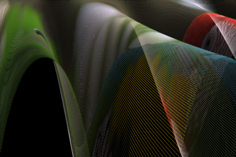

<h1 class="title">imager: an R package for image processing</h1>

[Simon Barthelmé](http://sites.google.com/site/simonbarthelme) (GIPSA-lab, CNRS) 

<!--  -->

R is a bit lacking in the area of image processing, where Matlab is still king. Imager aims to make image processing work in R easier. It is based on [CImg](http://cimg.sourceforge.net/), a C++ library by David Tschumperlé. CImg provides an easy-to-use and consistent API for image processing, which imager largely replicates. CImg supports images in up to four dimensions, which makes it suitable for basic video processing/hyperspectral imaging as well. 

## Features

At this stage imager contains over 100 functions, and covers all the classics:

- loading and saving images in various formats
- displaying and plotting images
- working with pixel neighbourhoods 
- interpolation, resizing, warping
- filtering and FFTs
- morphological operations 
- denoising 
- ... 

imager aims to be fast (doing things in C++ as much as possible), but also R-friendly, and defines many convenience functions that make it easy to work with native R datatypes and functions. 

## Installing the package

Imager is now on CRAN, so

	install.packages("imager")

should to the trick. If you prefer the latest development version, see our [Github page](https://www.github.com/dahtah/imager). 

## Dependencies

OS X users need to install XQuartz: https://www.xquartz.org/. You'll also need [ImageMagick](http://www.imagemagick.org/script/binary-releases.php) and [ffmpeg](http://ffmpeg.org/download.html) if you want to work with videos, or import and save images in formats other than BMP, PNG and JPEG. On Linux these should be available from standard repositories (ie. "sudo apt-get install ffmpeg" should work). On OS X they are available via brew: "brew install imagemagick ffmpeg". 

## Getting started 

There's a tutorial included in the package:  hit

	vignette("gettingstarted",package="imager")

or [click here](gettingstarted.html).

The tutorial covers basic image manipulation, plotting use base graphics and ggplot2, getting image data in and out, and an example of multiscale blob detection.

The next step is to learn about pixsets, which are used to represent sets of pixels (e.g., the foreground in an image).

		vignette("pixsets",package="imager")

The vignette includes an example of image segmentation. 

## Documentation

### General package documentation 

Many functions are described in the general package [documentation](imager.html). The automatically generated docs are [here](https://cran.r-project.org/web/packages/imager/imager.pdf), and come with examples. 

### FAQ

See here for [Frequently Asked Questions](FAQ.html). 

### Tutorials, case studies, etc. 

<!--html_preserve-->

    

		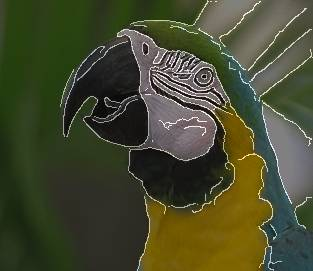
        <h3><a href="canny.html">Canny edge detector</a></h3>
      
 how to write fast functional code: a loop-free Canny edge detector 

    

  	

	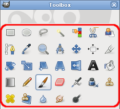
        <h3><a href="gimptools.html">Imager as an image editor</a></h3>
      
Where do I find the bucket tool in imager?

    

  	

	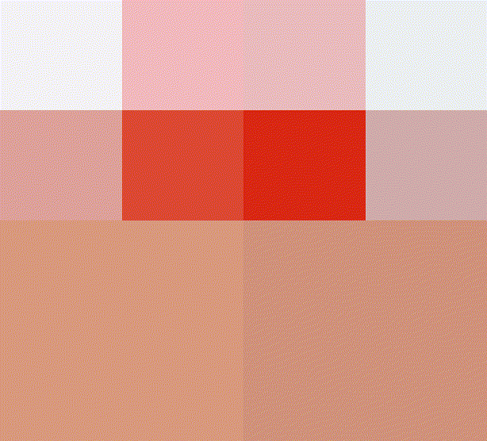
        <h3><a href="quadtrees.html">Quadtrees</a></h3>
      
Image splitting, simplification and recursive data structures.

    

  	

	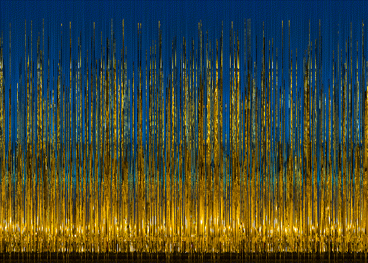
        <h3><a href="unsuffle.html">Image unshredding</a></h3>
      
 Shuffle the columns of an image, and put it back together by solving a TSP. 

    

    

		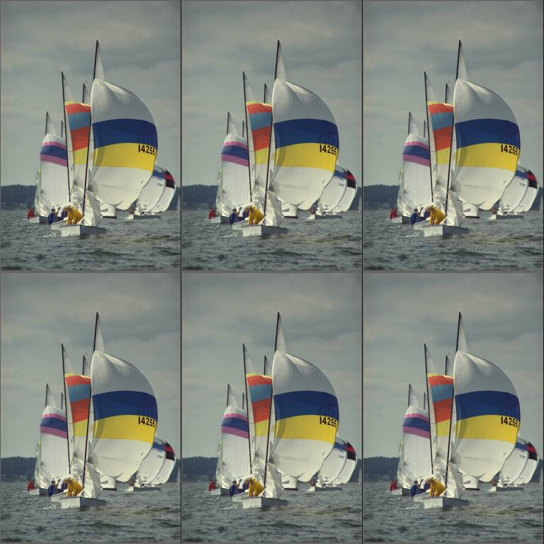
        <h3><a href="parallel.html">Parallelising</a></h3>
      
 How to parallelise computations  

    

	

    

		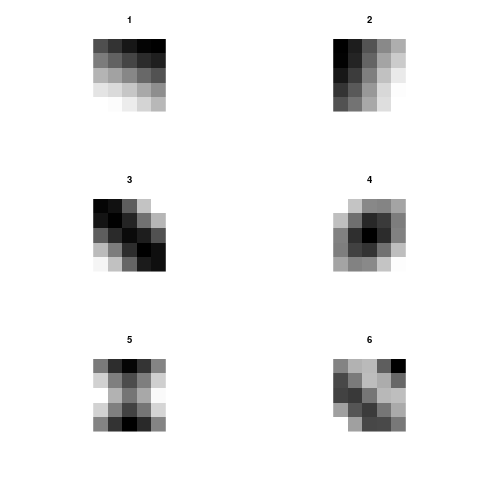
        <h3><a href="image_stats.html">Image statistics</a></h3>
      
 An (incomplete) tutorial on image statistics 

    

    

		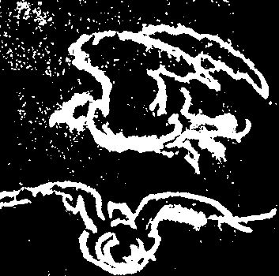
        <h3><a href="morphology.html">Image morphology </a></h3>
      
 A tutorial on morphology and detrending 

    

    

		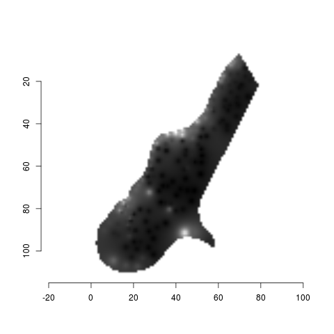
        <h3><a href="otherpackages.html">Other packages </a></h3>
      
 Importing image data from other R packages 

    

    

		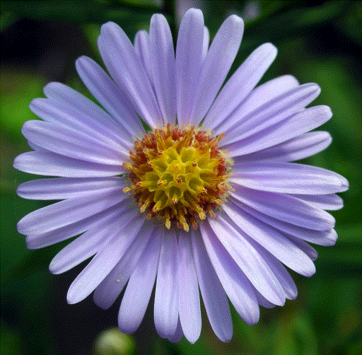
        <h3><a href="foreground_background.html">Foreground and background</a></h3>
      
 Image segmentation using nearest-neighbour classifiers, watershed transform 

    

	    

		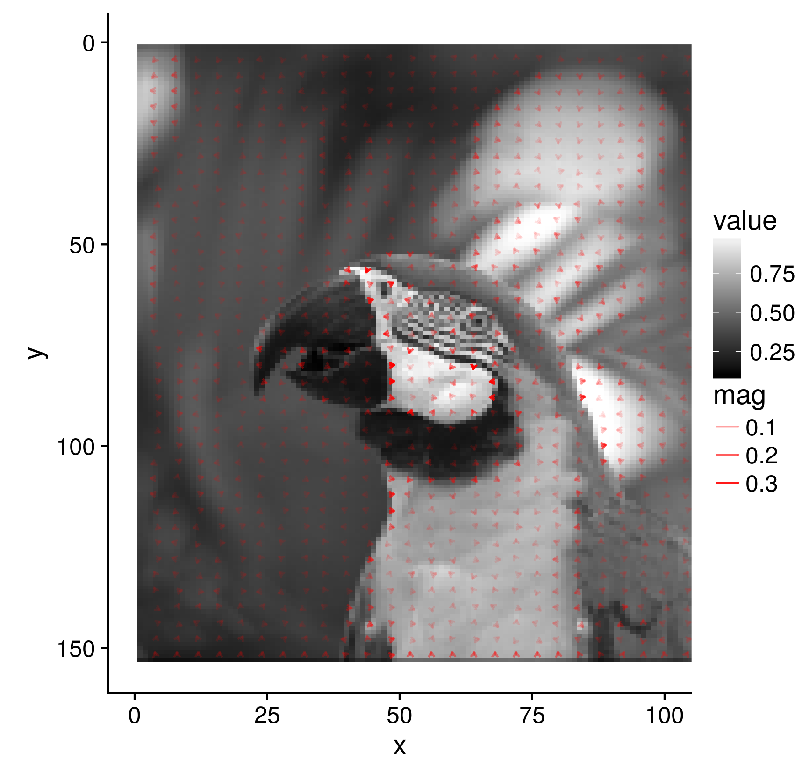
        <h3><a href="gradient_field.html">Gradient fields</a></h3>
      
 Plotting gradient fields using ggplot2 

    

<!--/html_preserve-->

### Tutorials, case studies, etc. 

There's also a number of tutorials and case studies:

- imager as an [image editor](gimptools.html). Where do I find the bucket tool in imager?
- how to [parallelise](parallel.html) computations 
- how to write fast functional code: [a loop-free Canny edge detector](canny.html)
- image splitting, simplification and recursive data structures: [quad-trees](quadtrees.html)
- how to import image data from [other R packages](otherpackages.html)
- [image unshredding](unshuffle.html): shuffle the columns of an image, and put it back together by solving a TSP. 
- [ASCII art](ascii_art.html): how to render an image using only characters. 
- a [tutorial](image_stats.html) on natural image statistics using imager
- another (incomplete) tutorial on [morphology and detrending](morphology.html)
- a [tutorial](foreground_background.html) on [foreground/background segmentation](http://opensource.graphics/how-to-code-a-nice-user-guided-foreground-extraction-algorithm/)
- plotting the [image gradient as a vector field](gradient_field.html)
- information on [accessing the CImg API using Rcpp](cpp_api.html)

You might find [CImg](http://cimg.eu/)'s doc useful as well. 

## Bugs, issues, etc.

Bugs and miscellaneous problems can be reported on the [issues page](https://github.com/dahtah/imager/issues) on Github. 
