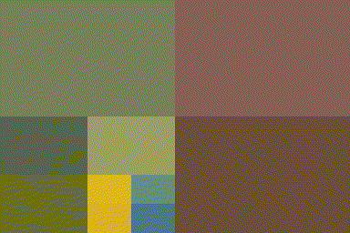

[Simon Barthelmé](http://sites.google.com/site/simonbarthelme) (GIPSA-lab, CNRS)

The following is a implemention in imager of [Quads](https://github.com/fogleman/Quads) by Michael Fogleman. It illustrates the use of imager, purrr and recursion to work with recursive data structures. 


A quadtree is a recursive data-structure that subdivides an image into four quadrants, which can themselves be subdivided into sub-quadrants, etc. 
For compression, we build a quadtree such that image regions that are unhomogeneous are divided more finely. Homogenous image regions are simply assigned their mean colour. 


Subdividing can be done using "imsplit"
```{r message=FALSE}
library(imager)
library(purrr)

im <- load.example('parrots') %>% imresize(.5)

#Divide along x, then y
qsplit <- function(im)
{
    imsplit(im,"x",2) %>% map(~ imsplit(.,"y",2)) %>%
        flatten 
}

qsplit(im) %>% as.imlist %>% plot

```

The inverse operation uses "imappend":

```{r}
qunsplit <- function(l)
{
    list(l[1:2],l[3:4]) %>% map(~ imappend(.,"y")) %>% imappend("x")
}

qsplit(im) %>% qunsplit %>% plot

```

The algorithm works by iterative refinement: at each iteration we find the least homogeneous region, and split it into four quadrants. Homogeneity is measured by the standard deviation of pixel values: 
```{r}
#Max std. dev across channels
imsd <- function(im)
{
    imsplit(im,"c") %>% map_dbl(sd) %>% max
}
```

The refinement function is recursive. It traverses the tree depth-first, looking for the least-homogeneous leaf (leaves are image regions). 

```{r}
refine <- function(l)
{
    if (is.cimg(l)) #We have a leaf
    {
        qs <- qsplit(l) #Split
        if (any(dim(l)[1:2] <= 4)) #Quadrants are very small
        {
            qs$sds <- rep(0,4) #Prevent further refinement
        }
        else
        {
            qs$sds <- map_dbl(qs,imsd) #Store std.dev of children
        }
        qs
    }
    else #Not a leaf, explore further
    {
        indm <- which.max(l$sds) #Find child with max. std. dev
        l[[indm]] <- refine(l[[indm]]) #Refine
        l$sds[indm] <- max(l[[indm]]$sds) #Update std. dev
        l
    }
}
```

Refinement will produce ever-deeper trees. To visualise them, we need to reconstruct an image from the tree. That's the job of *rebuild*, which again is recursive: 

```{r}
rebuild <- function(l,borders=FALSE)
{
    map(l[-5],~ if (is.cimg(.)) meanim(.,borders=borders) else rebuild(.,borders=borders)) %>% qunsplit
}

#Produce an image that's just the average of image im
#Optionally, add borders
meanim <- function(im,borders=FALSE)
{
    im <- imsplit(im,"c") %>% map(~ 0*. + mean(.)) %>% imappend("c")
    if (borders)
    {
        im[px.borders(im)] <- 0
    }
    im
}

```

The way rebuild works is as follows: look at the current node. If the node is a leaf, approximate it. If the node has children, call rebuild on the children and recombine them using qunsplit. 

```{r}
iter.refine <- function(im,nIter)
{
    for (i in seq_len(nIter)) { im <- refine(im) };
    im
}

#The first four iterations of the process
map_il(1:4,~ iter.refine(im,.) %>% rebuild) %>% plot

#After 200 iterations
iter.refine(im,200) %>% rebuild(borders=T) %>% plot
```

```{r echo=FALSE}

plot.iter <- function(im,nIter,show)
{
    l <- imrep(0*im,n=length(show))
    ii <- 1
    for (i in seq_len(nIter)) {
        im <- refine(im)
        if (i %in% show)
        {
            l[[ii]] <- rebuild(im)
            ii <- ii+1
        }
    }
    as.imlist(l)
}

out <- plot.iter(im,1000,exp(seq(1,log(1000),l=10)) %>% round) 
imappend(out,"z") %>% save.video("quadtrees_parrots.gif",fps=2)

im <- load.image("https://upload.wikimedia.org/wikipedia/commons/thumb/1/15/Red_Apple.jpg/1024px-Red_Apple.jpg") %>% imresize(.3)
out <- plot.iter(imresize(im,2),1000,exp(seq(1,log(1000),l=10)) %>% round)
imappend(out,"z") %>% save.video("quadtrees_apple.gif",fps=2)

```

The next image is an animation showing the first 1,000 steps of the process: 


